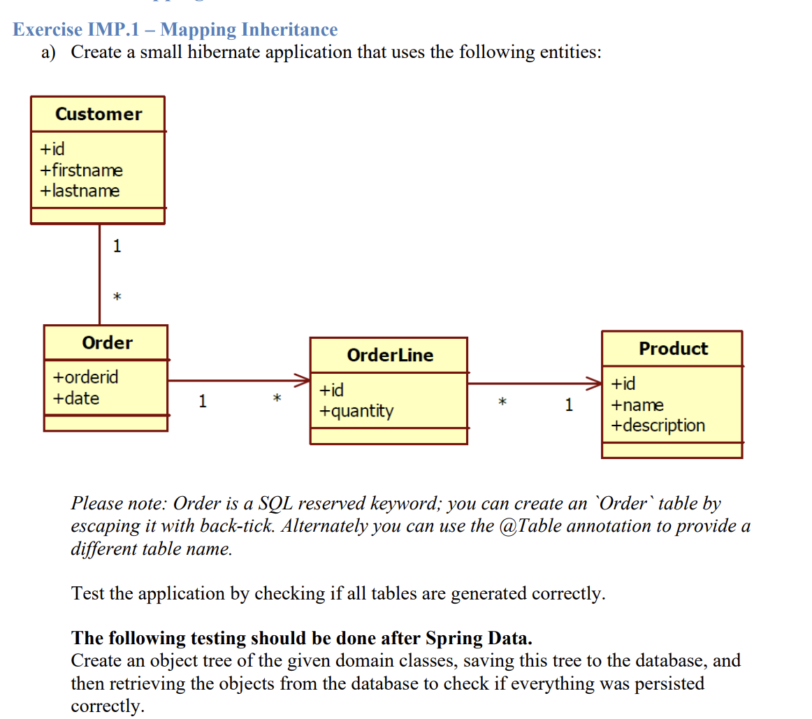
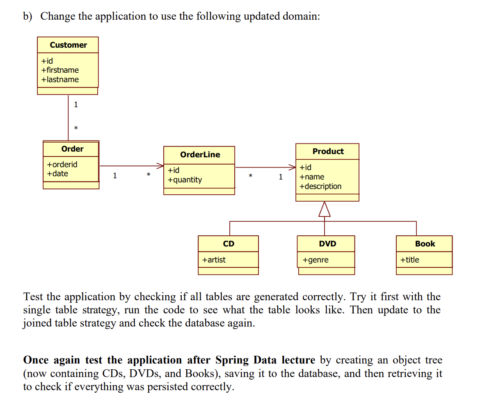
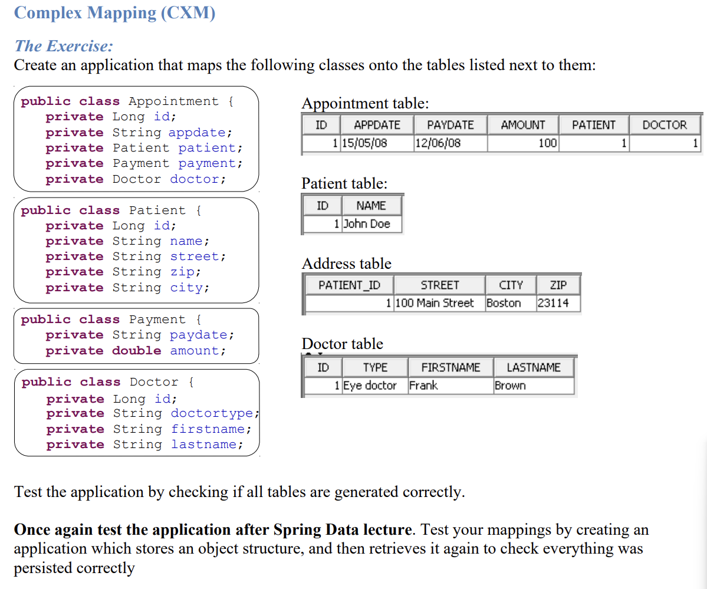

## Lab5: JPA Relationships





## Prerequisites

Before you begin, ensure you have the following installed:

- Java Development Kit (JDK)
- Apache Maven
- MySQL installation with schema named "lab5"

## Build the Application

To build the Spring Boot application and create a JAR file, run the following Maven command in the project directory:
```
mvn clean package
```

## Run the Application

To run the Spring Boot application as executable jar file, use the following command:

```
java -jar target/lab5-1.0.0.jar
```

To run the Spring Boot application with mvn plugin (mvn package not required)
```
mvn spring-boot:run
```

## Verify the tables created in "lab5" schema

